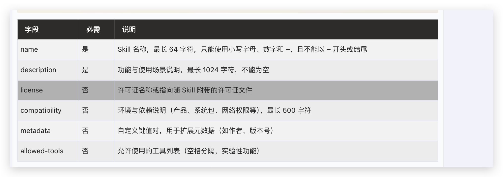
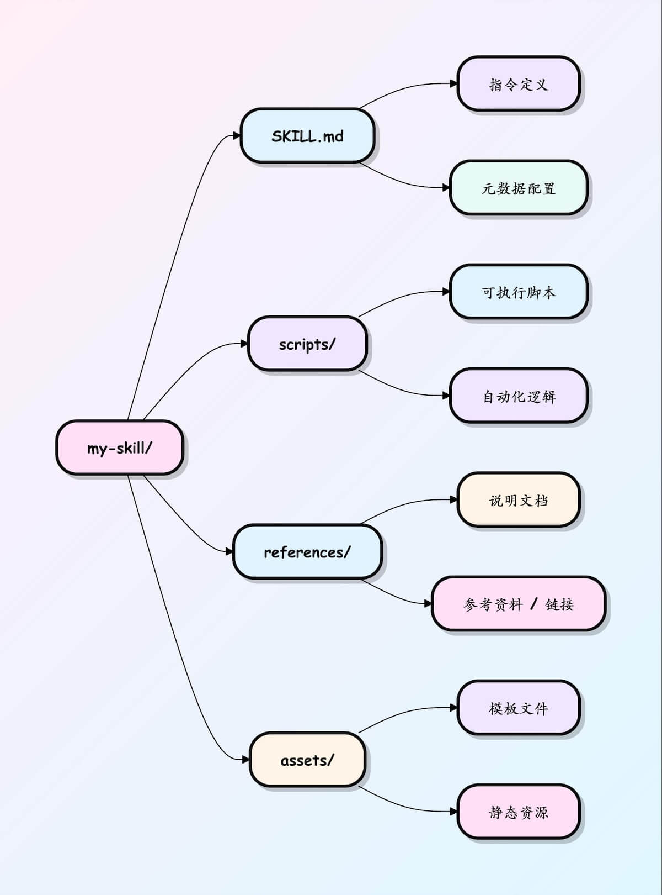

# Skill：从 Prompt 模板到 Agent 能力资产

## 一、先从提示词工程说起：为什么 Skill 不是凭空出现的

要真正理解 Skill，最好不要一上来就看目录结构，而是先把它放回 AI 应用演化的上下文里。

在 Skill 大规模进入大家视野之前，AI 交互和 AI 应用优化最核心的方法，其实一直是 **提示词工程（Prompt Engineering）**。

提示词工程解决的是一个非常基础、但又非常关键的问题：

> **当模型本身已经很强时，如何通过更好的输入设计，让它更准确、更稳定、更低成本地完成任务。**

如果用最朴素的话来讲，提示词工程就是：

- 你如何提问
- 你给多少背景
- 你如何限制格式
- 你如何让模型先思考再回答
- 你如何减少跑题、幻觉和格式漂移

这一套方法，本质上是在提升“人和模型之间的对齐度”。

### 1. 清晰比华丽更重要

Prompt Engineering 最重要的一条，是写清楚提示词：

- 说清楚任务
- 说清楚受众
- 说清楚输出格式
- 说清楚不要做什么

比如：

- 模糊提示： “帮我优化一下这个 React 组件。”
- 高质量提示： “你是一个 React 性能优化专家。请分析以下代码中的无效重渲染问题，使用 useMemo 和 useCallback 进行重构。请严格按以下格式输出：1. 发现的性能瓶颈；2. 重构后的代码；3. 逻辑分离说明（注意：仅做组件逻辑分离，不要擅自对业务逻辑做任何额外更改）。”

这件事非常重要，因为 Skill 后来做的，其实是把这种“说清楚任务”的能力，从一次性交互提升成了可复用结构。

### 2. 角色、上下文、约束、格式，本来就是 Prompt 的基本骨架

一个成熟 Prompt 往往包括：

- 角色设定
- 背景知识
- 规则约束
- 输出格式
- 示例

这和一个优秀 Skill 的结构其实是同源的。

区别在于：

- Prompt 是一次性装配
- Skill 是长期模块化沉淀

换句话说，Skill 不是 Prompt Engineering 的反面，而是它的工程化延伸。

### 3. Prompt Chaining 已经隐含了“工作流”的思想

提示词工程后来演化出一个很重要的方法，叫 **Prompt Chaining**：

- 第一步提取信息
- 第二步分析信息
- 第三步生成结果
- 前一步输出作为后一步输入

这个思想已经非常接近 Skill 的工作流设计了。

也就是说，在 Prompt Chaining 里，大家已经意识到：

> 复杂任务不能只靠一条“超级提示词”完成，而应该被拆成多个阶段。

Skill 只是把这个思想继续推进了一步：

- 不再只是临时串 Prompt
- 而是把这套工作流固化成可触发、可维护、可共享的能力模块

### 4. 为什么 Prompt Engineering 最终会走向 Skill

因为 Prompt Engineering 虽然强，但它天然有几个局限：

- 它太依赖每次临时写 Prompt
- 很难系统复用
- 复杂场景下上下文会膨胀
- 经验往往留在对话里，而不是沉淀成资产

所以从工程演化角度看，Skill 并不是一个突兀的新发明，而更像是：

> **Prompt Engineering 在 Agent 时代的一次模块化、资产化、工作流化升级。**

理解这一点很重要，因为它能帮我们避免把 Skill 看成一个孤立概念。

---

## 二、从 Prompt、Rules、MCP 到 Skill：中间到底缺了什么

如果我们回看过去一年 AI 应用的演化，大多数增强方式大概可以分成三层。

### 1. Prompt：一次性告诉模型这次怎么做

这是大家最熟悉的方式。

比如你想让模型重构一个 React 组件的性能问题，于是你会写一大段：

- 先分析组件中的无效重渲染
- 识别出需要 memoize 的函数和值
- 使用 useMemo 和 useCallback 进行优化
- 确保依赖数组完整且稳定
- 输出重构后的代码和性能对比

这种方式的问题很明显：

- 每次都要重写
- 一旦漏掉要求，结果就漂
- 随着任务变复杂，Prompt 会越来越长
- 很多隐性经验无法稳定复现

所以 Prompt 更像是一次性的口头交代。

### 2. Rules / Memory：长期约束模型的行为或偏好

第二层常见增强方式是记忆、规则、系统提示中的偏好配置。

它适合解决：

- 输出风格
- 基本行为边界
- 常驻偏好
- 长期上下文

例如：

- 默认优先用中文回答
- 默认先给结论
- 默认搜索时优先某个来源
- 某些信息不允许外发

但 Rules 不适合承载一个复杂工作流。

因为它更像“行为约束”，而不是“任务执行方法”。

### 3. Tools / MCP：让模型拥有能力接入

第三层是工具和 MCP。

它解决的是：

- 模型能不能读数据库
- 能不能调 API
- 能不能操作浏览器
- 能不能访问 Notion / Linear / Slack / GitHub

这一步非常关键，因为没有工具，Agent 很多时候只是会说，不会做。

但这里马上出现另一个问题：

> 给了模型工具，不等于给了它稳定完成复杂任务的能力。

一个典型例子是：

你把 Linear、Drive、Figma 都接给了 Agent，它确实“能调用”这些工具，但你让它做一次完整的设计交付流程，它未必知道：

- 先该读什么
- 后该创建什么
- 哪些字段必须校验
- 设计稿和任务之间如何挂接
- 成功和失败的判定条件是什么

也就是说，Tools / MCP 解决的是“可达性”，不是“方法论”。

### 4. Skill：把能力接入提升为工作流能力

Skill 的价值就在这里。

它把“调用能力”进一步提升成“执行方法”。

所以如果要用一句最简洁的话来概括：

- **Prompt**：这次怎么做
- **Rules**：平时该怎么表现
- **MCP / Tools**：你能调用什么
- **Skill**：遇到这类事，应该按什么专业流程去做

这就是 Skill 诞生的背景，也是它为什么会突然重要起来。

---

## 三、Skill 的本质：不是一个文件，而是一种上下文工程方法

很多介绍 Skill 的文章，会先告诉你目录结构。我也会讲结构，但我更想先讲它背后的方法。

Skill 的真正核心，不在于 `SKILL.md` 这几个字符，而在于一种非常适合 Agent 的上下文组织方式：

> **渐进式披露 / 按需加载**

这个概念几乎可以说是理解 Skill 的钥匙。

### 1. 为什么“全塞上下文”不是好办法

过去 Prompt Engineering 里一个常见做法，是把所有规则、流程、案例、格式要求一次性塞进系统提示词或用户提示里。

短任务还行，复杂任务就会很快出现问题：

- token 成本高
- 上下文污染严重
- 模型注意力分散
- 不相关规则也一直占着上下文

举个简单的例子。

如果一个 Agent 同时具备：

- 写技术文章
- 做 PR Review
- 生成周报
- 处理财务报销
- 做设计交付

你总不能把这 5 套完整 SOP（流程自动化） 永久塞在系统提示里。那不是增强，是噪音。

### 2. Skill 的三层加载模型

Skill 优雅的地方在于，它把上下文加载分成了几层。

#### 第一层：元数据层

在启动时，Agent 只需要知道每个 Skill 的最小信息，通常包括：

- `name`
- `description`

这层的目标非常克制：

**只负责让模型知道“什么时候可能该用这个 Skill”。**

它不承担执行细节。

#### 第二层：主说明层

只有当模型判断当前任务与某个 Skill 匹配时，才去读取这个 Skill 的 `SKILL.md` 正文。

这部分通常包含：

- 核心流程
- 阶段步骤
- 输出标准
- 错误处理
- 对参考资料和脚本的调用提示

也就是说，真正的 SOP 不是常驻的，而是在需要时才加载。

#### 第三层：资源层

如果 Skill 更复杂，还可以继续往下拆：

- `references/`：风格规范、案例、术语表、API 文档
- `scripts/`：确定性脚本、检查工具、格式转换器
- `assets/`：模板、样板、图标、结构化资源

这层更进一步，把“不是每次都需要”的内容从主说明里移出去。

结果就是：

- 日常上下文更轻
- 复杂 Skill 也能做大
- 模型在执行时不会被无关细节淹没

### 3. 为什么这不是“小技巧”，而是一种重要架构

我觉得很多人还没有意识到，渐进式披露不是一个简单的 token 优化技巧，而是一种非常关键的 Agent 架构设计原则。

它意味着我们不再把 Agent 能力看成一段巨大、静态、全量加载的说明书，而是把能力拆成：

- 可发现
- 可触发
- 可按需展开
- 可组合
- 可演化

这就是 Skill 真正和“长 Prompt 模板”拉开差距的地方。

---

## 四、一个 Skill 到底长什么样


说完理念，再回到最表层的结构。

一个最小 Skill 目录通常是这样：

```text
my-skill/
└── SKILL.md
```

一个更完整、工程化的 Skill，通常会长这样：

```text
my-skill/
├── SKILL.md
├── references/
├── scripts/
└── assets/
```

其中：

- `SKILL.md` 是入口文件
- `references/` 放按需参考资料
- `scripts/` 放需要执行的脚本
- `assets/` 放模板或静态资源

### 一个最小可用的 `SKILL.md`

下面是一个非常简单但有效的例子：

```md
---
name: react-render-analyzer
description: 深入分析 React 组件代码，排查无效重渲染和遗漏的 Hook 依赖。当开发者要求检查组件性能或排查渲染问题时触发。
---

# React 渲染性能分析器

## 执行指令 (Instructions)

1. 解析提供的 React 组件源码。
2. 识别出渲染阶段（render phase）内所有的状态变更，以及对象/函数的重复分配。
3. 检查 `useEffect` 和 `useCallback` 的依赖数组，找出遗漏的或不稳定的引用。
4. 以项目符号列表的形式输出潜在的性能风险点。
5. 提供修复后的代码片段。**核心约束：仅专注于渲染层面的 Hooks 修复。在提取或重构任何代码片段（例如 `getFormItemInfo` 等具体的业务方法）时，必须绝对保持其原始的业务逻辑，严禁对其进行过度优化或擅自篡改。**
```

这个 Skill 很短，但它已经具备了最重要的几个元素：

- 有明确名字
- 有可触发的描述
- 有清晰的执行步骤
- 没有废话

### 为什么很多 Skill 写得很长，反而变差

一个常见误区是：为了让 Skill 看起来“专业”，把大量背景、解释、概念介绍塞进 `SKILL.md`。

结果通常是反效果。

因为模型本来就已经很懂通用知识。Skill 最应该提供的是：

- 模型原本不知道的业务知识
- 该场景特有的判断标准
- 输出要求
- 执行顺序
- 失败处理方式

所以一个好 Skill 的原则通常是：

> **只补模型本来不知道、但做这件事必须知道的内容。**

如果你只给 Agent 一个指令让它‘把旧依赖换成新依赖，它可能会把项目搞崩。一个合格的迁移 Skill，必须在工作流中写死这些工程底线：

- 校验先行： 必须先读取 package.json，明确检查旧包确实存在于项目中，然后才能触发后续操作。

- 顺序锁死： 依赖替换绝对不能乱序。Skill 必须规定：先执行新包的安装（Step 2），校验写入成功后，再执行旧包的卸载（Step 3）。

- 安全边界： 在执行项目全局的字符串查找和替换时，Skill 必须强制规定将 package-lock.json 等锁定文件排除在操作范围之外，防止底层依赖树被意外破坏。”

---

## 五、ant-design skill 深度拆解：从生态决策指南到工作流设计

要真正理解 Skill 的设计精髓，最好的方式不是看理论，而是直接拆解真实的高质量 Skill。这里我们聚焦两个来自 Ant Design 生态的核心 Skill：

### 1. ant-design skill：生态决策指南

这个 Skill 来自 [antd-skill 仓库](https://github.com/ant-design/antd-skill)，定位为 Ant Design 生态的决策指南。它的核心价值在于：

> **把整个 Ant Design 生态的知识、版本语义、决策逻辑封装成 Agent 可以直接消费的工作流。**

#### 1.1 触发边界与能力路由

它的 frontmatter 设计非常值得学习：

```md
---
name: ant-design
description: Decision guide for antd 6.x, Ant Design Pro 5/ProComponents, Ant Design X v2, and the offline `@ant-design/cli`. Use for component selection, theming/tokens, SSR, a11y, performance, routing/access/CRUD, AI/chat UI patterns, local API lookup, debugging, migration, and usage analysis.
---
```

这个 `description` 做了三件关键事：
1. **明确版本范围**：antd 6.x、Ant Design Pro 5、Ant Design X v2
2. **绑定工具链**：离线 `@ant-design/cli`
3. **列举适用场景**：从组件选择到迁移分析，共11类具体任务

这相当于给 Agent 一张"能力地图"，让它知道什么时候该触发、触发后该处理哪类问题。

#### 1.2 S-P-O 结构：先划边界，再给流程

这个 Skill 采用了非常成熟的 S-P-O（Scope-Process-Output）结构：

**S - Scope（范围）**：先定义技术栈边界
- Target: `antd@^6` + React 18-19
- Tooling: `@ant-design/cli`
- Focus: decision guidance only
- Source policy: official docs only

**P - Process（流程）**：三阶段工作流
1. **Classify（分类）**：判断是 core antd、Pro 还是 X，确认版本和渲染模式
2. **Query authoritative sources（查询权威来源）**：使用 `antd info`、`antd demo`、`antd doc` 等命令获取结构化信息
3. **Decide（决策）**：基于查询结果选择方案，考虑 Provider baseline、Theming baseline 等

**O - Output（输出）**：规定交付结构
- 短决策理由
- provider / theming strategy
- SSR / a11y / perf checks
- Pro 和 X 场景下的额外方向说明

#### 1.3 强制规则：把工程底线写进工作流

这个 Skill 最强的地方之一，是它的 Mandatory rules：

- 在写或改 antd 组件代码前，先用 `antd info <Component> --format json` 查询 API
- 永远使用 `--format json` 确保结构化输出
- 修改 antd 代码后，要运行 `antd lint <changed-path> --format json`
- 如果 CLI 自身出错，应该准备 `antd bug-cli` preview，而不是静默绕过

这些规则不是"建议"，而是"硬约束"。它们确保 Agent 在执行时不会跳过关键的质量检查步骤。

### 2. antd skill：命令行工作流操作手册

如果说 `ant-design` skill 是"决策指南"，那么 `antd` skill（来自 `ant-design-cli`）就是"操作手册"。这两个 Skill 形成了完美的互补关系。

#### 2.1 面向任务检测的触发设计

`antd` skill 的 frontmatter 更强调任务检测：

```md
---
name: antd
description: 用户任务涉及 Ant Design，包括写组件、调试、查询 props/tokens/demos，涉及迁移或 usage 分析，会被 antd 相关代码、`import from 'antd'`、显式问题触发。
allowed-tools: 
  - `Bash(antd *)`
  - `Bash(antd bug*)`
  - `Bash(npm install -g @ant-design/cli*)`
  - `Bash(which antd)`
---
```

这个设计有几个亮点：
1. **具体触发条件**：明确列出会被什么代码、什么导入语句触发
2. **工具白名单**：限制 Agent 只能使用特定的 CLI 命令
3. **环境准备**：包含 `which antd` 检查，确保工具可用

#### 2.2 场景化工作流模板

`antd` skill 最大的特色是按场景拆解 workflow：

- **Writing antd component code**：写组件代码
- **Debugging antd issues**：调试问题
- **Migrating between versions**：版本迁移
- **Analyzing project usage**：使用分析

每个场景都定义了完整的命令序列。例如"写组件代码"场景：

```bash
antd info Button --format json      # 查询 API
antd demo Button basic --format json # 获取示例
antd semantic Button --format json   # 语义分析
antd token Button --format json      # 主题令牌
```

并强调 workflow 是：`antd info` → 理解 props → `antd demo` → 取工作示例 → 再写代码

#### 2.3 质量反馈闭环

这个 Skill 最妙的一段，是它要求 Agent：

> 如果在使用 `antd` CLI 的过程中，发现命令崩溃、返回错误数据、行为和文档不一致、不同命令之间出现不一致，就应该主动准备 `antd bug-cli` 报告预览，并征求用户确认后提交。

这展示了 Skill 设计的另一个重要维度：**不只是教 Agent 怎么用工具，还教它如何做质量反馈，形成工具生态的正反馈闭环。**

### 3. 两个 Skill 的对比与协同

| 维度 | ant-design skill | antd skill |
|------|------------------|------------|
| 定位 | 生态决策指南 | 命令行操作手册 |
| 核心 | 决策逻辑与工作流 | 命令序列与场景模板 |
| 结构 | S-P-O 框架 | 场景化 workflow |
| 强项 | 边界定义、规则约束 | 具体操作、质量反馈 |
| 关系 | 告诉 Agent"该做什么" | 告诉 Agent"怎么做" |

这两个 Skill 形成了一个完整的协同体系：
- `ant-design` skill 负责**战略层**：判断任务类型、选择工具、定义质量边界
- `antd` skill 负责**战术层**：执行具体命令、处理异常、收集反馈

这种分层设计，正是 Skill 工程化的核心价值：**把复杂任务拆解成可组合、可复用、可维护的能力模块。**

---

## 六、Skill / CLI / MCP：三层架构应该怎么理解

到这里，我们已经有了两个非常合适的例子：
- `antd-skill`
- `ant-design-cli`

现在可以把它们抽象成一个更通用的三层架构视角。

### 1. 第一层：Skill 层 —— 决策与工作流层

Skill 最适合承载的内容包括：
- 任务分类
- 决策规则
- 步骤顺序
- 输出约束
- 风险检查
- 工具调用时机

它负责回答的是：

- 现在应该做什么
- 下一步该做什么
- 哪个工具该什么时候上场
- 成功和失败如何判断

所以可以把 Skill 看成：

**Agent 的工作流大脑。**

### 2. 第二层：CLI / Script 层 —— 可执行能力层

CLI、脚本、可执行工具最适合承载：
- 查询
- 校验
- lint
- migration
- 数据分析
- 环境诊断
- 结构化输出

它解决的是：

- 怎样高效、确定性地完成某一步
- 怎样避免模型自己“编一个答案”
- 怎样把结果交给后续步骤继续处理

所以 CLI / Script 层更像：

**Agent 的执行器和传感器。**

### 3. 第三层：MCP 层 —— 原生工具暴露与系统接入层

MCP 最适合承载：
- 把能力暴露成原生可调用工具
- 让 IDE / Agent runtime 统一接入
- 让外部系统变成可编排能力源

它解决的是：
- 工具怎么被稳定接入
- 外部系统能力怎么进入 Agent 运行环境
- 多工具如何在统一协议下协同

所以 MCP 更像：

**Agent 的能力接口层。**

### 4. 三层是怎么协同工作的

一个很典型的执行链路会是：

1. 用户提出问题
2. Skill 判断任务类型与执行路径
3. Skill 选择调用 CLI 或 MCP 工具
4. CLI / MCP 返回结构化数据
5. Skill 根据结果继续决策、补充验证、组织输出

这意味着：

- Skill 不负责底层数据细节
- CLI 不负责整体工作流判断
- MCP 不负责业务决策逻辑

它们各自分工明确，但一起才能构成真正稳定的 Agent 系统。

### 5. 为什么这个架构视角很重要

因为很多团队在做 Agent 时容易出现两个极端：

#### 极端一：只有 Prompt / Skill，没有可执行工具
结果是：
- 模型会讲，但做不实
- 流程像样，但结果不够确定

#### 极端二：只有一堆工具，没有 Skill 编排
结果是：
- 工具很多
- 但 Agent 不知道何时用、先后顺序、校验边界
- 最终交付不稳定

真正成熟的方案通常是三层协同：

- **Skill** 负责工作流与决策
- **CLI / Script** 负责执行与校验
- **MCP** 负责标准化接入与工具暴露

这也是为什么 `ant-design/antd-skill + ant-design-cli` 这个组合，值得在技术分享里重点讲。

它不是因为它“是 Ant Design”，而是因为它清楚地把这三层关系都示范出来了。

---

## 七、Skill 与 MCP 的真正关系：不是二选一，而是上下两层

讨论 Skill 时，另一个经常被问到的问题是：

> Skill 和 MCP 到底谁更重要？

我觉得这个问题本身就不太对。

因为这两者根本不是一个层面上的东西。

### 1. MCP 解决的是“能力接入”

MCP 的核心价值，是把外部系统能力接给 Agent。

例如：

- GitHub MCP：读 issue、开 PR、看 CI
- Linear MCP：查项目、建任务、更新状态
- Slack MCP：发消息、读频道
- Figma MCP：取设计资源
- 数据库 MCP：查数据

### 2. Skill 解决的是“工作流编排”

Skill 解决的问题则是：

- 遇到这类任务时先做什么
- 哪些工具该按什么顺序调用
- 哪些信息必须校验
- 哪些阶段需要确认
- 产物应该如何串起来

所以更准确地说：

- MCP 给 Agent 提供“器官”
- Skill 给 Agent 提供“神经回路”

### 3. 一个完整案例：设计交付流程

假设有这样一套工具能力：

- Figma MCP：读取设计稿、组件、资源
- Drive MCP：存放导出的交付文件
- Linear MCP：创建任务并关联研发流程
- Slack MCP：通知团队

现在需求是：

> 把一个设计稿转成研发可执行的交付包，并同步给工程团队。

如果你只有 MCP，没有 Skill，会发生什么？

Agent 可能确实知道这些工具“能用”，但它并不知道完整流程该怎么组织。它未必知道：

- 应该先从 Figma 拿到哪些内容
- 设计说明应该怎么组织
- Drive 里交付包目录怎么建
- Linear 任务字段如何填写
- Slack 通知里该带哪些链接
- 失败时应在哪一步中止

所以，只有 MCP，你拿到的是散装能力；
有了 Skill，你才能把这些散装能力组装成一个稳定工作流。

---

## 八、结语：Skill 不是 Prompt 的小升级，而是 Agent 工程化的一块关键拼图

如果要用一句话收束全文，我会这样说：

> **Prompt Engineering 解决的是“怎么把一句话说清楚”，而 Skill Engineering 解决的是“怎么把一套工作方法沉淀成 Agent 能长期复用的能力”。**

这两者当然不是敌对关系。

Prompt 仍然重要，MCP 仍然重要，Rules 也仍然重要。

但当我们真正开始构建可交付、可维护、可扩展的 Agent 系统时，Skill 这一层几乎是绕不过去的。

因为它正好处在一个非常关键的位置：

- 向下连接工具能力
- 向上承载业务工作流
- 横向沉淀组织经验
- 纵向支持持续迭代

所以我对 Skill 的判断一直很明确：

它不是一个小功能，也不是 Prompt 的文件化替代品。

它更像是：

**Agent 时代把“工作方法”变成“能力资产”的最轻量、最现实、也最容易规模化的一种载体。**

---

## 参考资料

- [Prompt Engineering（菜鸟教程）](https://www.runoob.com/ai-agent/prompt-engineering.html)
- [Skills 教程（菜鸟教程）](https://www.runoob.com/ai-agent/skills-agent.html)
- [Anthropic：Equipping agents for the real world with Agent Skills](https://www.anthropic.com/engineering/equipping-agents-for-the-real-world-with-agent-skills)
- [Google Developer Blog：Developer’s Guide to Building ADK Agents with Skills](https://developers.googleblog.com/developers-guide-to-building-adk-agents-with-skills/)
- [OpenClaw Docs：Skills](https://docs.openclaw.ai/tools/skills)
- [OpenClaw Docs：Creating Skills](https://docs.openclaw.ai/tools/creating-skills)
- [awesome-agent-skills](https://github.com/libukai/awesome-agent-skills)
- [Claude Skills 完全构建指南](https://github.com/libukai/awesome-agent-skills/blob/main/docs/Claude-Skills-%E5%AE%8C%E5%85%A8%E6%9E%84%E5%BB%BA%E6%8C%87%E5%8D%97.md)
- [Ant Design Skills 仓库](https://github.com/ant-design/antd-skill)
- [Ant Design `ant-design` Skill 原始文件](https://raw.githubusercontent.com/ant-design/antd-skill/main/skills/ant-design/SKILL.md)
- [Ant Design `antd` Skill 原始文件](https://raw.githubusercontent.com/ant-design/antd-skill/main/skills/antd/SKILL.md)
- [Ant Design CLI 仓库](https://github.com/ant-design/ant-design-cli)
- [Ant Design CLI 自带 Skill 原始文件](https://raw.githubusercontent.com/ant-design/ant-design-cli/main/skills/antd/SKILL.md)
